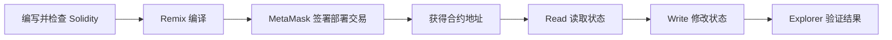

# Monad CheckIn Mini Demo 0

> 一个已经部署到 Monad Testnet 的最小链上打卡合约，也是我从“照步骤操作”走向理解智能合约完整链路的 Week 1 作品。

## 1. 作品概览

`CheckIn` 是一个使用 Solidity `0.8.24` 编写的最小智能合约。每个钱包都可以：

- 使用 `getMyCheckIns()` 读取自己的打卡次数；
- 使用 `checkIn()` 发起真实链上交易，将个人和全局打卡次数各增加一次；
- 通过区块浏览器验证合约部署和写入交易。

这个 Demo 不追求复杂功能，重点是证明我已经完成以下闭环：



## 2. 我做了什么

1. 使用课程专用钱包连接 Monad Testnet。
2. 检查 `CheckIn.sol` 的状态变量、Read / Write 函数和事件。
3. 使用 Remix 编译 Solidity 合约。
4. 通过 MetaMask 签署部署交易。
5. 调用 `getMyCheckIns()` 读取个人打卡次数。
6. 调用 `checkIn()` 完成一次真实的链上状态更新。
7. 在 MonadVision 中核对合约地址、交易 Hash、区块和执行状态。
8. 总结 AI 辅助与人工判断的边界，并选择 Week 2 的 Tech 方向。

合约源码：[`contracts/CheckIn.sol`](contracts/CheckIn.sol)

## 3. 真实链上部分

### 合约

| 项目 | 记录 |
| --- | --- |
| Network | Monad Testnet |
| 部署时记录的 Chain ID | `10143` |
| Contract Address | [`0xB71E1A8Fe59F6B104B7C05a94Bfbc755e34BE818`](https://testnet.monadvision.com/address/0xB71E1A8Fe59F6B104B7C05a94Bfbc755e34BE818) |
| Deployer | [`0x78d85df608B9d7cf2f8b87A80e2aE70629CAaAB3`](https://testnet.monadvision.com/address/0x78d85df608B9d7cf2f8b87A80e2aE70629CAaAB3) |

### 部署交易

| 项目 | 记录 |
| --- | --- |
| Status | Success |
| Transaction | [`0xcab88b72ab3eecb7cc876c00bb20ed3ed4dbf7b0443a33e81082e69df9ee9ee6`](https://testnet.monadvision.com/tx/0xcab88b72ab3eecb7cc876c00bb20ed3ed4dbf7b0443a33e81082e69df9ee9ee6) |
| Block | [`45132741`](https://testnet.monadvision.com/block/45132741) |
| Gas | `253895` |

### `checkIn()` 交互交易

| 项目 | 记录 |
| --- | --- |
| Status | Success |
| Function | `checkIn()` |
| Transaction | [`0x9d3a1ce660521cac3e2e7868a4fd03e2896b1c39d7cf2bdb325695417adea7e3`](https://testnet.monadvision.com/tx/0x9d3a1ce660521cac3e2e7868a4fd03e2896b1c39d7cf2bdb325695417adea7e3) |
| Block | [`45134467`](https://testnet.monadvision.com/block/45134467) |
| Gas | `80996` |

Read 调用不修改链上状态，因此不会生成 Transaction Hash。本次状态验证路径为：

```text
getMyCheckIns() = 0
→ 调用 checkIn()
→ 交易执行成功
→ getMyCheckIns() = 1
```

## 4. AI 辅助了什么

我让 AI 根据以下需求生成并解释最小合约：

> 使用 Solidity 0.8.24 编写一个链上打卡合约；每个钱包可以调用 `checkIn()`；记录个人与全局次数；包含 Read、Write 和事件；避免不必要的复杂逻辑。

AI 提供了：

- `CheckIn` 合约初稿；
- 钱包、Gas、ABI、合约地址和 Transaction Hash 的概念解释；
- Remix 与 MetaMask 的部署和交互步骤；
- README 和链上证据的整理框架；
- 从 CheckIn 演化到 Community Quest 的初步产品思路。

## 5. 我做了哪些人工判断

AI 不能代替我完成以下判断和验证：

1. 核对 MetaMask 连接的是课程钱包和正确的测试网络。
2. 检查 `getMyCheckIns()` 是不修改状态的 `view` 函数。
3. 检查 `checkIn()` 会同时更新个人次数和全局次数。
4. 确认合约没有转账、提款或外部合约调用。
5. 在 Explorer 中核对真实的合约地址、交易 Hash 和成功状态。
6. 判断“允许无限打卡”适合最小 Demo，但不适合直接用于真实产品。
7. 判断并非所有产品数据都应该上链，只把需要公开验证和可信共享的结果放到链上。

我的核心认识是：

> AI 可以生成方案和解释过程，但不能代替我验证链上事实，也不能替我决定产品设计是否合理。

## 6. 当前限制

- 当前通过 Remix 与合约交互，还没有独立前端。
- 任意钱包可以重复调用 `checkIn()`，没有每日限次或防刷机制。
- 合约只记录钱包地址和次数，没有任务 ID、奖励规则或排行榜。
- 这是测试网学习作品，不涉及真实资产，也不构成生产级合约。

这些限制不是被隐藏的问题，而是下一阶段开发范围的依据。

## 7. Week 2 方向：Tech

我选择 **Tech**。

Week 1 中，我最感兴趣的不是只描述一个 Web3 产品，而是理解 Solidity 合约如何变成用户可以实际操作的应用。目前我已经走通部署和手动交互，下一步希望补齐前端、钱包连接、交易状态显示、事件读取和链上数据展示。

计划将 `CheckIn` 演化为 **Monad Community Quest**：

1. 增加任务 ID 和积分奖励。
2. 防止同一钱包重复领取同一个任务的积分。
3. 通过事件保留可索引的任务完成记录。
4. 创建最小网页，连接钱包并调用合约。
5. 读取个人积分，通过事件或 Indexer 计算排行榜。
6. 为链下任务设计可信的完成证明机制。

## 8. 作品集 / 简历描述

> 在 Monad Testnet 上完成 Solidity 打卡合约的代码检查、部署及 Read / Write 交互，通过区块浏览器验证链上交易，并规划其向社区任务积分 DApp 的演化路径。

## 9. 下一步希望解决的问题

> 如果 Community Quest 的任务发生在链下，应该如何证明用户真实完成了任务，同时避免用户直接调用合约函数刷分？

延伸问题：

- `Next.js + Viem` 是否适合作为新手构建最小 DApp 的技术栈？
- 排行榜应在合约内维护，还是通过事件和 Indexer 在链下计算？

## 10. 提交材料

- 作品仓库：[Monad_Bootcamp](https://github.com/echo5177/Monad_Bootcamp)
- Week 1 Build Log：[`README.md`](README.md)
- Mini Demo 0：[`MINI_DEMO_0.md`](MINI_DEMO_0.md)
- 合约源码：[`contracts/CheckIn.sol`](contracts/CheckIn.sol)

本仓库不包含私钥、助记词、钱包密码、API Key、`.env`、未公开会议链接或聊天记录。
