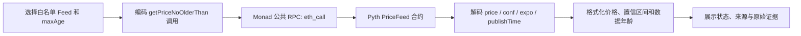

# Week 3 Dev Validation

## 核心技术方案

Monad Price Lens 是一个零依赖静态网页。浏览器向 Monad 公共 RPC 发起 `eth_call`，调用 Pyth PriceFeed 的 `getPriceNoOlderThan(bytes32,uint256)`。返回的四个 ABI word 被解码为 `price`、`conf`、`expo` 和 `publishTime`，再在本地转换成可读结果。

## 可复用的代码与工具

- 通用 JSON-RPC `eth_call` 请求器。
- `int256` ABI word 的补码解码。
- 基于 `price × 10^expo` 的无浮点误差格式化。
- 置信值与置信比例计算。
- 时间戳、数据年龄和 Fresh / Aging / Stale 状态组件。
- 白名单 Feed 配置，可复用于 Moss Adapter 的可视化验证。

函数选择器经 `viem` 计算为 `0xa4ae35e0`，不是手填猜测。

## 真实链上部分与 Mock 边界

| 模块 | 类型 | 说明 |
| --- | --- | --- |
| Monad RPC 查询 | 真实 | 直接请求 `https://rpc.monad.xyz`，链 ID 143 |
| Pyth PriceFeed | 真实 | 合约 `0x2880aB155794e7179c9eE2e38200202908C17B43` |
| MON/USD、BTC/USD、ETH/USD Feed ID | 真实 | 来自 Pyth 官方 Feed 列表并固定为 allowlist |
| 数据解码和格式化 | 真实 | 浏览器根据 RPC 返回值实时计算 |
| V1 / V2 截图 | 证据快照 | 只证明截图时页面状态，不冒充持续实时数据 |
| 外部 Tester Agents | AI 预检 | 用于发现表达与流程问题，不冒充真人同学反馈 |

主流程没有伪造价格或静态 Mock。网络或合约调用失败时页面进入 Error，不自动切换成“看起来成功”的模拟结果。

## 简化与取舍

- 使用静态 HTML/CSS/JavaScript，避免为了一个只读路径引入框架、后端和部署密钥。
- 只开放三个白名单 Feed，避免任意输入带来的错误地址和误导风险。
- 不接钱包，因为 `eth_call` 无需账户、签名或 Gas。
- 不做历史图表，因为当前合约调用只证明最近价格，不提供完整历史数据。

## 对产品方向的影响（100 字以上）

Dev 验证让项目从“做一个价格页面”收敛为“解释一条可追溯的 Monad 链上价格”。`getPriceNoOlderThan` 要求用户明确时间阈值，这促使页面同时展示发布时间、数据年龄和 maxAge，而不是只放一个绿色圆点。ABI 解码也证明 `price` 必须结合 `expo`，`conf` 应与价格一起展示。由于整个流程可用只读 RPC 完成，钱包连接反而会增加误解和安全成本，因此被移出 Week 3。

## 核对来源

- [Pyth EVM Contract Addresses](https://docs.pyth.network/price-feeds/core/contract-addresses/evm)
- [Pyth `getPriceNoOlderThan`](https://api-reference.pyth.network/price-feeds/evm/getPriceNoOlderThan)
- [Pyth Best Practices](https://docs.pyth.network/price-feeds/core/best-practices)
- [Moss Pyth Adapter PR #146](https://github.com/nishuzumi/moss/pull/146)

## 可直接提交的说明

技术方案、流程图、可复用模块、简化项和真实/Mock 边界均记录在本页。核心路径是真实 Monad `eth_call`，外部测试 Agent 只作为 AI 预检，不伪装成真人反馈。
