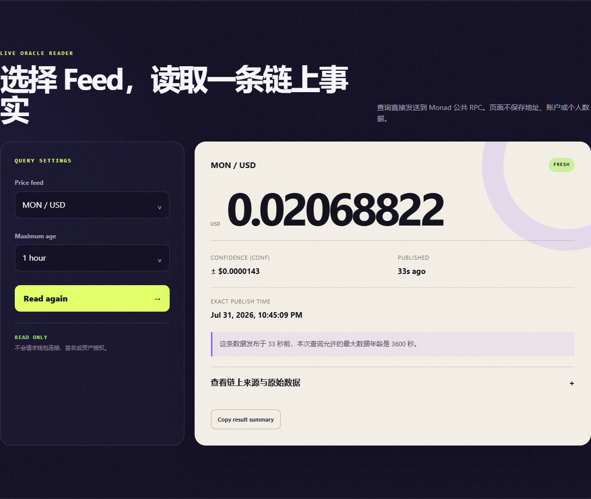

# Week 3 Product Experience & Feedback

## 测试范围

V1 测试对象是 [Monad Price Lens V1 截图](docs/screenshots/monad-price-lens-v1.png) 与本地真实查询页面。统一任务如下：

> 不看额外教程，选择 MON/USD 并回答：价格是多少、何时发布、是否新鲜、Confidence 代表什么、是否需要钱包？最后指出最困惑的一点。

成功标准：90 秒内完成查询；能说明四个核心字段中的至少三个；不会把 Confidence 当作收益保证；知道这是只读工具。

## 三个独立外部预检

| 测试者 | 身份与视角 | 完成情况 | 主要反馈 |
| --- | --- | --- | --- |
| 小芽 | 外部 AI，新手视角 | 一次点击完成查询，识别价格、时间、FRESH 和无需钱包 | Confidence 解释离结果太远；时间没有时区；FRESH 的阈值含义不够就地 |
| 数澜 | 外部 AI，Research 视角 | 找到价格、conf、maxAge、来源和原始字段 | 缺 conf/price 百分比与显式价格区间；缺区块高度、查询时间和 RPC 记录 |
| 栈雀 | 外部 AI，前端与可访问性视角 | Chrome 查询成功，无控制台错误；390×844 无横向溢出 | 整张结果卡的 live region 可能重复朗读；表单无可访问名称；标题出现孤字换行；键盘焦点不统一 |

这三名测试者是独立 AI usability pre-check，不是真人同学。使用 AI 预检是为了先发现流程、表达和可访问性问题，不用于伪造真实用户验证。

## 可观察结果

- 三个测试者都能完成查询，并确认页面没有钱包连接、签名或授权。
- 新手测试者在转录 V1 的小数时少写了一个 `0`。原截图是 `± $0.0000143`，测试记录写成了 `± $0.00000143`。这说明仅显示一串很小的绝对数值不够易读。
- Research 测试者愿意把产品用于快速 sanity check，但认为正式研究记录还需要区块、查询时间和更完整的 Confidence 表达。
- 前端测试者确认移动端没有横向溢出，安全边界和文字状态通过，但状态播报需要缩小范围。

## 归纳出的反馈

1. Confidence 必须在结果旁解释，并显示比例和上下界。
2. FRESH 必须直接说明它只相对于用户选择的 maxAge。
3. 精确时间应带时区；研究证据应带区块高度、UTC 查询时间和 RPC。
4. 状态只在短文案中播报，表单需要可访问名称，所有操作控件需要明显的键盘焦点。
5. 标题不能出现孤字换行，Evidence 导航应自动展开证据区。

## 真人反馈边界

本任务原文要求邀请至少三名外部同学。当前已经完成三视角 AI 预检和公开招募入口，但**不能把它们提交成三名真人同学反馈**。真人部分仍需在公开 Demo 发布后补充。

公开招募入口：[GitHub Feedback Issue #1](https://github.com/echo5177/Monad_Bootcamp/issues/1)

可直接发送给同学的邀请：

> 我做了一个无需钱包的 Monad Pyth 价格解释器，想请你做 5 分钟体验。打开 Demo 后查询 MON/USD，告诉我你看到的价格和发布时间、你怎样理解 Confidence 和 Fresh，以及哪里最困惑。不需要钱包地址或个人信息。

请让三名同学直接回复 Issue，或保存已获同意的匿名截图。不要公开对方姓名、钱包或群聊隐私。

## 证据

## 可直接提交的说明

已完成三名外部 AI 测试者的独立预检、五条反馈归纳和公开反馈 Issue，并明确标注 AI 身份。若平台严格要求“外部同学”，请先取得三条真人回复再把本页状态改为完成。
