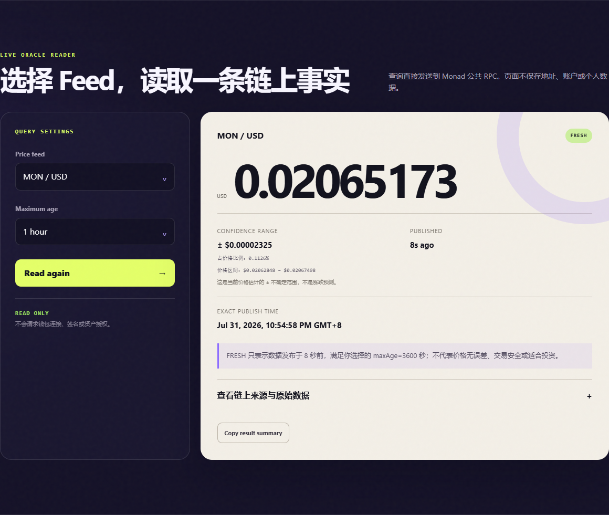

# Week 3 Feedback Iteration

## 采用了什么反馈

V1 能完成真实查询，但小数置信值、FRESH 条件和证据锚点不够直观。V2 没有增加新产品功能，而是把已有数据讲清楚。

| V1 | V2 | 采用原因 |
| --- | --- | --- |
| 只显示绝对 Confidence | 增加 conf/price 百分比、价格上下界和就地解释 | 新手转录时少写一个 0，Research 用户也无法横向比较 |
| FRESH 与阈值说明分离 | 状态句直接写数据年龄、maxAge 和“不代表安全” | 避免把时间新鲜误解成准确或投资建议 |
| 精确时间无时区 | 显示本地时区缩写 | 跨地区协作不再靠猜 |
| 只有合约、Feed 和 raw response | 增加区块高度、UTC 查询时间和 RPC endpoint | 截图与研究记录更容易追溯 |
| 整张结果卡是 live region | 只让短状态文案使用 `role=status` | 减少辅助技术重复朗读 |
| 表单无名称、焦点样式不统一 | 增加 `aria-labelledby` 和统一 `:focus-visible` | 让键盘与屏幕阅读器用户知道当前区域和焦点 |
| 标题孤字换行，Evidence 跳转后仍关闭 | 调整标题宽度；导航点击时展开 details | 修复明显的阅读中断 |

## 前后对比

### V1

### V2

两张图中的价格不同，因为它们是不同时间的真实链上查询，不是固定 Mock。

## 没有采纳的建议

- 没有增加历史曲线或更多行情卡。它们不会解决当前的理解问题，还会引入新的数据来源。
- 没有把 FRESH 改成“安全”。Fresh 只表示满足所选时间阈值。
- 没有加入钱包。只读 `eth_call` 不需要签名。

## 验证结果

- `node --test tests/price-utils.test.mjs`：4/4 通过。
- 最终 Chrome 真实查询：MON/USD、BTC/USD、ETH/USD 三个 Feed 均成功返回 FRESH、价格和区块高度。
- 浏览器控制台：0 个 error。
- 390×844 移动视口：页面宽度与视口同为 390px，没有横向溢出；表单名称、独立状态节点和 Evidence 自动展开通过。
- V1 证据保留在 Git 历史和截图中，V2 没有覆盖旧证据。

## 可直接提交的说明

本页包含采用反馈、未采用反馈、V1/V2 截图、代码行为和验证结果，可作为“根据反馈完成至少一项改进”的提交材料。
